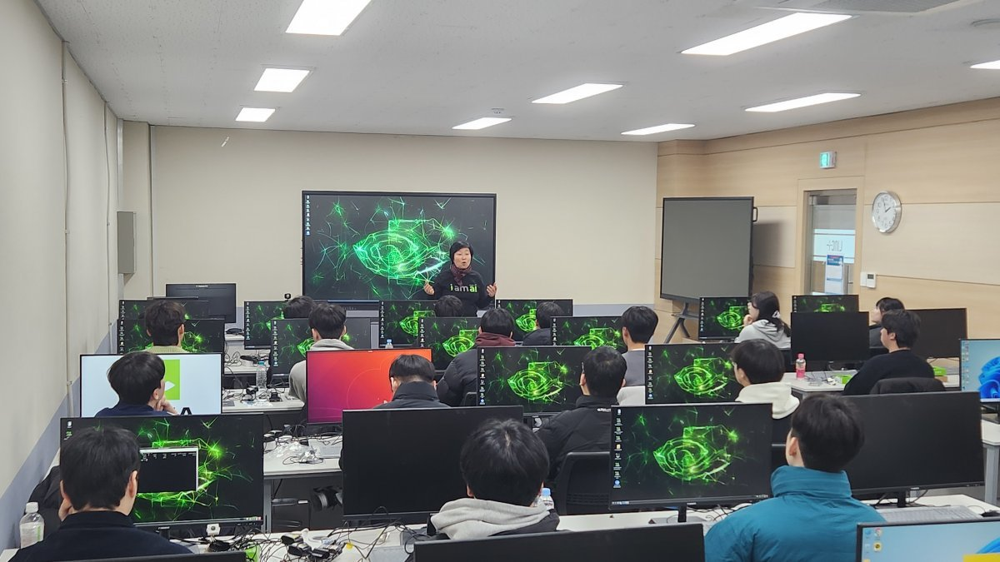

🧑‍🏫 Introduction to Jang Sung-sook

**Jang Sung-sook**, affectionately known as **"Jetson Mom"**, is a professional educator specializing in hands-on AI training using NVIDIA’s Jetson platform.  
She is particularly focused on **Edge AI education** using devices such as the **Jetson Nano**, actively mentoring both students and professionals.

---

🎓 Activities & Achievements

- Operated a **2-week AI certification program** based on Jetson Nano for all freshmen in the **Department of Future Mobility Engineering at Halla University**.
- Achieved a **100% certification pass rate** through practical, beginner-friendly instruction.
- The curriculum covered foundational topics in **deep learning** and **machine learning**, enabling students to confidently progress to intermediate and advanced levels.
- Her training emphasizes a **real-world, industry-aligned learning environment**, helping students become more competitive in **AI and robotics job markets** after graduation.

---

🔍 What Does "Jetson Mom" Mean?

The nickname **"Jetson Mom"** comes from her warm, supportive teaching style that resembles a nurturing mother guiding students through the basics of Jetson development.  
Her patient and structured approach has earned strong trust from learners, helping them grow step by step.

---

✅ Summary

| Field              | Details                                       |
|-------------------|-----------------------------------------------|
| **Name**           | Jang Sung-sook ("Jetson Mom")                 |
| **Role**           | NVIDIA Jetson Platform Educator               |
| **Specialties**    | Edge AI, Deep Learning, Machine Learning      |
| **Key Activities** | University AI Certification Courses, Mentoring |
| **Style**          | Warm, practical, hands-on education           |

---

